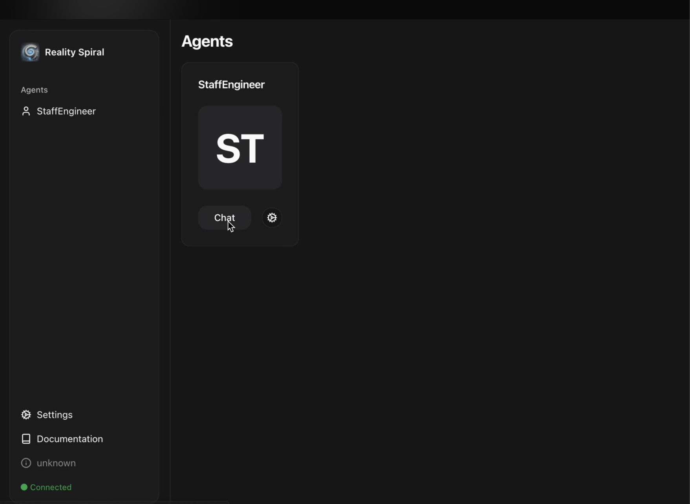

# Accumulated Finance Plugin

This plugin enables staking ROSE tokens on the Oasis Sapphire network via Accumulated Finance's wstROSE vault contract.

## Features

- Stake and unstake ROSE tokens
- View and claim staking rewards
- Check staked balances
- Wrapper functions for direct token conversion (wrapRose/unwrapRose)

## Architecture

This plugin implements the `AccumulatedFinancePluginType` interface, which provides methods for interacting with Accumulated Finance's ERC4626-compliant wstROSE vault contract.

- **wstROSE**: A tokenized vault that accepts ROSE tokens and mints wstROSE tokens in return
- **ERC4626**: A standard for tokenized vaults that allows for seamless composability

### Core Components

1. **plugin factory**: Creates an instance of the plugin with the provided runtime and configuration
2. **accumulated.ts**: Contains the implementation of all staking-related functions
3. **constants.ts**: Defines contract addresses, ABIs, and network-specific values
4. **types.ts**: TypeScript definitions for the plugin interface and configuration

## Usage

### Configuration

```typescript
import { accumulatedFinancePlugin } from '@reality-spiral/plugin-accumulated-finance';

const plugin = accumulatedFinancePlugin(runtime, {
  networkType: 'mainnet', // or 'testnet'
  privateKey: '0x...', // Optional if using Coinbase SDK wallet
  strategy: 'default' // Currently only 'default' is supported
});
```

### Staking Tokens

```typescript
const result = await plugin.stake({
  amount: '1000000000000000000', // 1 ROSE in wei
});

console.log(`Transaction hash: ${result.transactionHash}`);
console.log(`Staked: ${result.amount} ROSE`);
```

### Unstaking Tokens

```typescript
const result = await plugin.unstake({
  amount: '1000000000000000000', // 1 ROSE in wei
});

console.log(`Transaction hash: ${result.transactionHash}`);
console.log(`Unstaked: ${result.amount} ROSE`);
```

### Checking Rewards

```typescript
const rewards = await plugin.getRewards();
console.log(`Pending rewards: ${rewards.pendingRewards} ROSE`);
```

### Claiming Rewards

```typescript
const result = await plugin.claimRewards();
console.log(`Transaction hash: ${result.transactionHash}`);
```

### Getting Staked Balance

```typescript
const balance = await plugin.getStakedBalance();
console.log(`Staked balance: ${balance} ROSE`);
```

## Testing with RealitySpiral Agent UI

This section guides you through testing the Accumulated Finance plugin using the RealitySpiral Agent UI.

### Prerequisites

1. Copy `.env.example` to `.env` and configure the following variables:
   - Accumulated Finance related variables
   - `WALLET_PRIVATE` with your wallet private key

### Running the Agent UI

1. Install dependencies and start the development server:
   ```bash
   pnpm install
   pnpm dev
   ```

2. Wait for the server to start up (usually takes a few seconds)

3. Open the Agent UI in your browser:
   ```
   http://localhost:5173/
   ```



### Using the Agent

1. Select the `StaffEngineer` agent by clicking "Chat"

2. Interact with the agent using natural language commands. For example:
   ```
   Stake 0.3 ROSE with Accumulated Finance
   ```


3. Wait for the agent to process your request and respond with a confirmation message


4. The confirmation message will include a transaction hash that you can use to:
   - View transaction details on the [Oasis Explorer](https://explorer.oasis.io/)
   - Verify your wallet balance changes:
     - Decreased ROSE balance
     - Increased stROSE balance


## Implementation Details

### Staking Flow

1. Approve the wstROSE contract to spend ROSE tokens
2. Call the `deposit` function on the wstROSE contract
3. Receive wstROSE tokens representing your share of the vault

### Reward Mechanism

Rewards are accrued automatically through the increasing exchange rate between wstROSE and ROSE tokens:

1. The protocol periodically calls `syncRewards()` to distribute new rewards
2. This increases the amount of ROSE tokens backing each wstROSE token
3. When you unstake, you receive more ROSE tokens than you initially deposited

### Contract Dependencies

- **wstROSE (WSTROSE_ADDRESS)**: The main vault contract for staking
- **ROSE (ROSE_ADDRESS)**: The native token contract on Sapphire

## Network Support

- **Oasis Sapphire Mainnet**: Fully supported with deployed contracts
- **Oasis Sapphire Testnet**: Configuration available but contract addresses need to be added

## Dependencies

This plugin relies on:
- `ContractHelper` from `@reality-spiral/plugin-coinbase` for blockchain interactions
- Coinbase SDK for wallet management and transaction signing

## Development Status

⚠️ **Note**: This plugin is currently under active development and should not be used in production environments until the issues outlined in the UPDATED_REVIEW.md file have been addressed. 