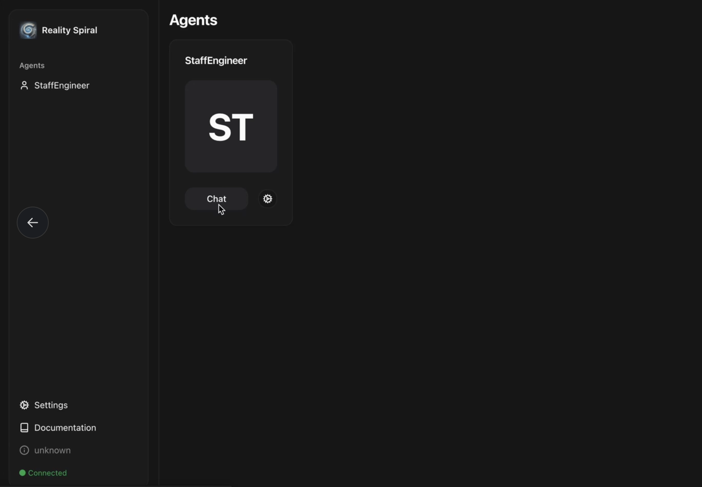

# @realityspiral/plugin-bitprotocol

Eliza plugin for interacting with the BitProtocol on Oasis Sapphire network with privacy-preserving features.

## Features

*   **Swap Tokens:** Perform stablecoin swaps between BitUSD and various collateral tokens.
*   **Private Swaps:** Execute confidential transactions using Oasis Sapphire's TEE capabilities.
*   **Monitor Stability:** Check the price stability of BitUSD against its peg.
*   **Find Optimal Paths:** Calculate the most efficient swap routes for token exchanges.

## Configuration

Requires runtime settings (e.g., environment variables) for:

*   `BITPROTOCOL_RPC_URL`: RPC endpoint for the Oasis Sapphire network (Mainnet or Testnet).
*   `BITPROTOCOL_NETWORK_ID`: Chain ID for the Oasis Sapphire network.
*   `BITPROTOCOL_MAX_SLIPPAGE` (Optional): Default max slippage (e.g., `0.005` for 0.5%).
*   `BITPROTOCOL_PRIVACY_ENABLED` (Optional): Enable/disable privacy features (defaults to `true`).

## Supported Tokens

* BitUSD (BitProtocol stablecoin)
* BIT (BitProtocol governance token)
* ROSE (Native Oasis token)
* wstROSE (Wrapped staked ROSE)
* mTBill (Maturity Treasury Bill)

## Privacy Features

This plugin leverages Oasis Sapphire's confidential computing environment to provide:

* Confidential transactions that hide transaction details
* Encrypted swap data using the Trusted Execution Environment (TEE)
* Private token approvals
* Secure key management

## Development

*   Build: `npm run build` or `pnpm build`
*   Watch: `npm run dev` or `pnpm dev`
*   Test: `npm run test` or `pnpm test`

## Integration with BitProtocol

This plugin integrates directly with BitProtocol's smart contracts on the Oasis Sapphire network, providing a secure, privacy-preserving interface for stablecoin operations. 

## Testing with RealitySpiral Agent UI

Follow these steps to test the BitProtocol plugin using the RealitySpiral Agent UI:

1. Copy `.env.example` to `.env` and set the relevant BitProtocol variables as well as the `WALLET_PRIVATE` variable with your wallet private key.

2. Run a local agent using command:
```bash
pnpm install
pnpm dev
```

3. Wait a few seconds during start up and when completed you can open the Agent UI:
```
http://localhost:5173/
```



4. Select the `StaffEngineer` agent (Click Chat)

5. Now you can write to the agent the following messages:
```
Swap 0.01 ROSE for BitUSD with BitProtocol
```


6. Wait few seconds for the agent to respond and then you should see as a result a confirmation of the successful swap operation


7. You can copy and paste the transaction hash shown in the confirmation message from the agent in the Oasis explorer:
```
https://explorer.oasis.io/
```

The explorer will show you all the details about the swap transaction. You should also be able to see your wallet balance getting updated:
- Less ROSE
- More BitUSD

 

