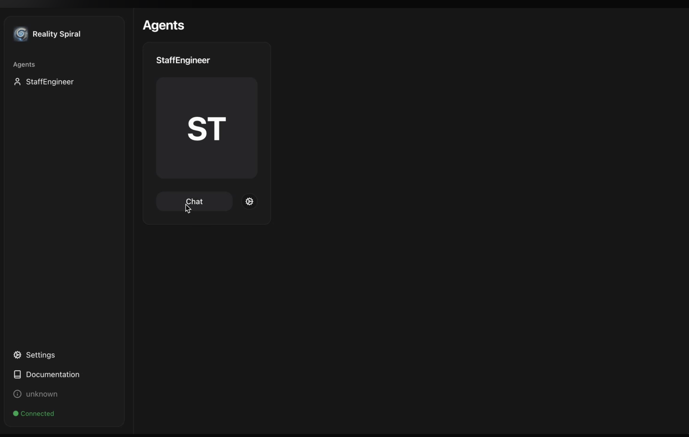

# Neby DEX Plugin

This plugin enables interaction with the Neby decentralized exchange (DEX) on the Oasis Sapphire network.

## Features

- Swap tokens with slippage protection
- Add and remove liquidity from pools
- Monitor token prices across different pools
- Find arbitrage opportunities
- Get detailed pool information and liquidity data

## Architecture

The plugin implements the `NebyPluginType` interface which provides methods for interacting with Neby DEX contracts on the Oasis Sapphire network.

### Core Components

1. **Plugin Factory**: Creates an instance of the plugin with the provided runtime and configuration
2. **Services**:
   - `SwapService`: Handles token swaps
   - `LiquidityService`: Manages adding/removing liquidity
   - `PriceService`: Handles price monitoring and arbitrage detection
   - `TokenQueries`: Provides token-related data queries
3. **Constants**: Defines contract addresses, ABIs, and network-specific values
4. **Types**: TypeScript definitions for the plugin interface and configuration

## Usage

### Configuration

```typescript
import { nebyPluginFactory } from '@realityspiral/plugin-neby';

const plugin = nebyPluginFactory(runtime, {
  network: 'mainnet', // or 'testnet'
  privateKey: '0x...', // Optional if using Coinbase SDK wallet
  maxSlippage: 0.5, // 0.5% slippage tolerance
  privacyLevel: 'high', // 'high' or 'standard'
});
```

### Swapping Tokens

```typescript
const result = await plugin.swap(
  '0xed57966f1566de1a90042d07403021ea52ad4724', // ROSE token address
  '0x1234...', // Token to swap to
  '1000000000000000000' // 1 token in wei
);

console.log(`Transaction hash: ${result.transactionHash}`);
console.log(`Swapped: ${result.amountIn} token A for ${result.amountOut} token B`);
```

### Adding Liquidity

```typescript
const result = await plugin.addLiquidity(
  '0xed57966f1566de1a90042d07403021ea52ad4724', // ROSE token address
  '0x1234...', // Second token address
  '1000000000000000000', // Amount of first token
  '5000000000' // Amount of second token
);

console.log(`Transaction hash: ${result.transactionHash}`);
console.log(`Added liquidity: ${result.amountA} token A and ${result.amountB} token B`);
```

### Removing Liquidity

```typescript
const result = await plugin.removeLiquidity(
  '0xed57966f1566de1a90042d07403021ea52ad4724', // ROSE token address
  '0x1234...', // Second token address
  '100000000' // Amount of liquidity to remove
);

console.log(`Transaction hash: ${result.transactionHash}`);
console.log(`Removed: ${result.amountA} token A and ${result.amountB} token B`);
```

### Monitoring Prices

```typescript
const prices = await plugin.monitorPrices();
prices.forEach(price => {
  console.log(`${price.tokenA}/${price.tokenB}: ${price.price} (${price.updatedAt})`);
});
```

### Finding Arbitrage Opportunities

```typescript
const opportunities = await plugin.findArbitrageOpportunities();
opportunities.forEach(opp => {
  console.log(`Route: ${opp.routeDescription}`);
  console.log(`Profit: ${opp.estimatedProfit} ${opp.profitToken} (${opp.confidence} confidence)`);
});
```

### Getting Pool Information

```typescript
const poolInfo = await plugin.getPoolInfo(
  '0xed57966f1566de1a90042d07403021ea52ad4724', // ROSE token address
  '0x1234...', // Second token address
  3000 // Fee in basis points (0.3%)
);

console.log(`Pool address: ${poolInfo.address}`);
console.log(`Liquidity: ${poolInfo.liquidity}`);
console.log(`Current tick: ${poolInfo.tick}`);
```

## Testing with RealitySpiral Agent UI

Follow these steps to test the Neby DEX plugin using the RealitySpiral Agent UI:

1. Copy `.env.example` to `.env` and set the relevant NEBY variables as well as the `WALLET_PRIVATE` variable with your wallet private key.

2. Run a local agent using command:
```bash
pnpm install
pnpm dev
```

3. Wait a few seconds during start up and when completed you can open the Agent UI:
```
http://localhost:5173/
```



4. Select the `StaffEngineer` agent (Click Chat)

5. Now you can write to the agent the following messages:
```
Swap 0.01 wROSE for USDC on Neby using my default slippage
```


6. Wait few seconds for the agent to respond and then you should see as a result a confirmation of the successful swap operation


7. You can copy and paste the transaction hash shown in the confirmation message from the agent in the Oasis explorer:
```
https://explorer.oasis.io/
```

The explorer will show you all the details about the swap transaction. You should also be able to see your wallet balance getting updated:
- Less wROSE
- More USDC


## Implementation Details

### Swap Flow

1. Approve the router contract to spend tokens (if needed)
2. Get a quote from the quoter contract
3. Calculate minimum output amount based on slippage tolerance
4. Execute the swap via the router contract

### Liquidity Management

1. For adding liquidity:
   - Sort tokens by address (lower address first)
   - Calculate tick range (defaulting to full range)
   - Approve token spending
   - Mint position via position manager

2. For removing liquidity:
   - Find position ID for token pair
   - Call decreaseLiquidity on position manager
   - Call collect to withdraw tokens

### Price Monitoring

- Queries the quoter contract to get current exchange rates
- Monitors multiple fee tiers (0.05%, 0.3%, 1%)
- Updates prices periodically

## Contract Dependencies

- **V3 Core Factory**: Creates and tracks liquidity pools
- **Position Manager**: NFT-based liquidity position manager
- **Swap Router**: Executes token swaps
- **Quoter**: Provides price quotes without executing swaps

## Network Support

- **Oasis Sapphire Mainnet**: Fully supported with deployed contracts
- **Oasis Sapphire Testnet**: Configuration available but contract addresses need to be verified

## Dependencies

This plugin relies on:
- `ContractHelper` from `@realityspiral/plugin-coinbase` for blockchain interactions
- Coinbase SDK for wallet management and transaction signing

## Security and Privacy Features

- **High Privacy Mode**: Uses confidential computing when available
- **Slippage Protection**: Prevents excessive price impact
- **Secure Key Management**: Private keys are handled securely via Coinbase SDK 