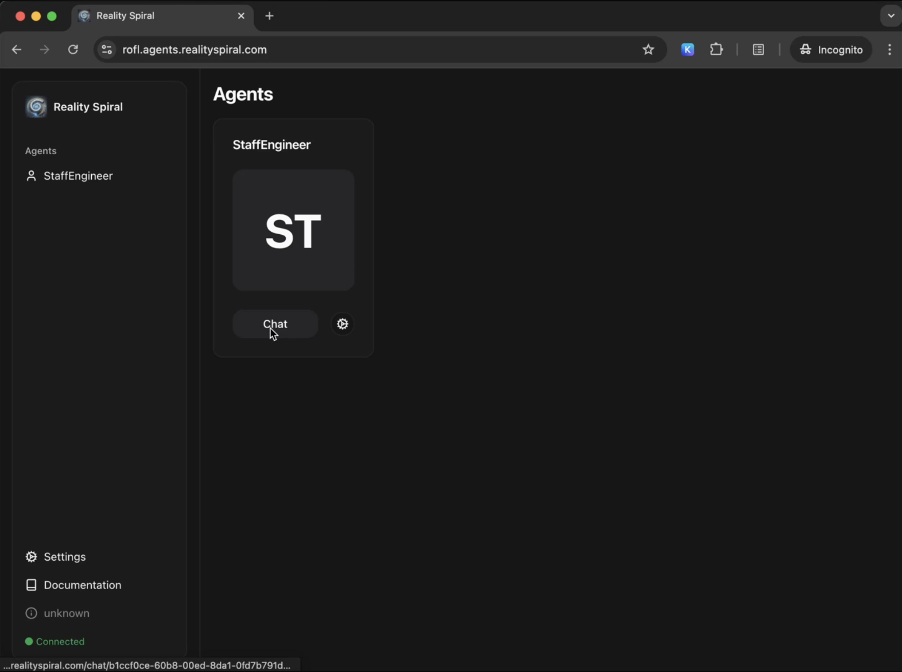
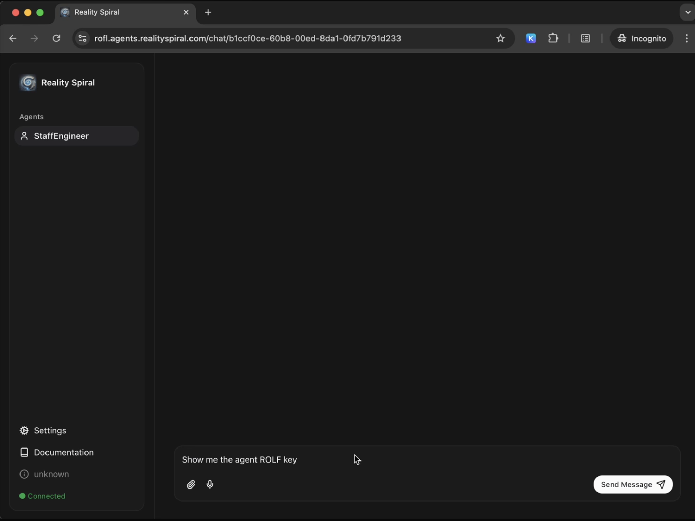
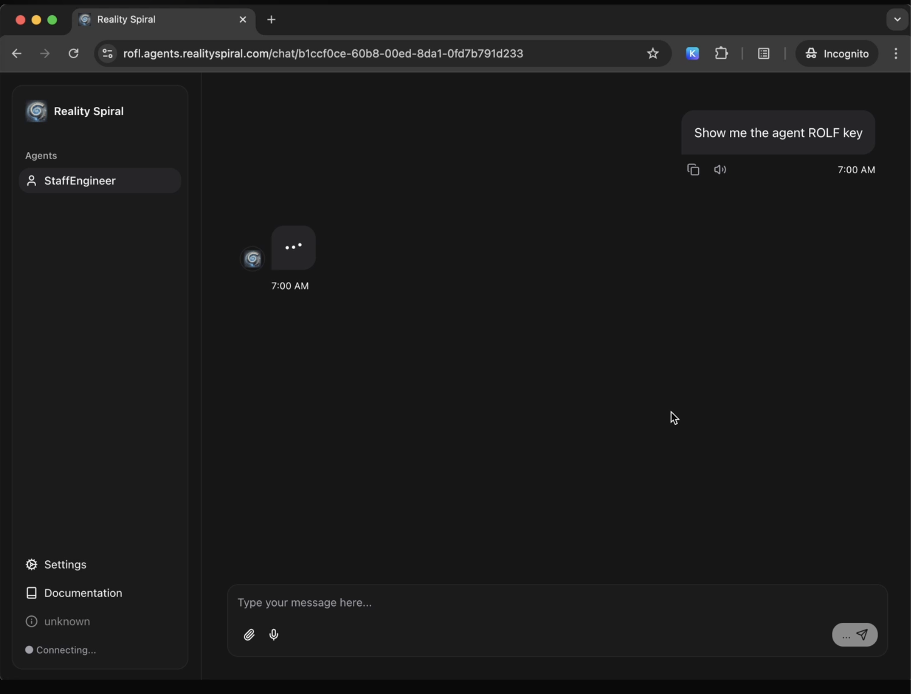
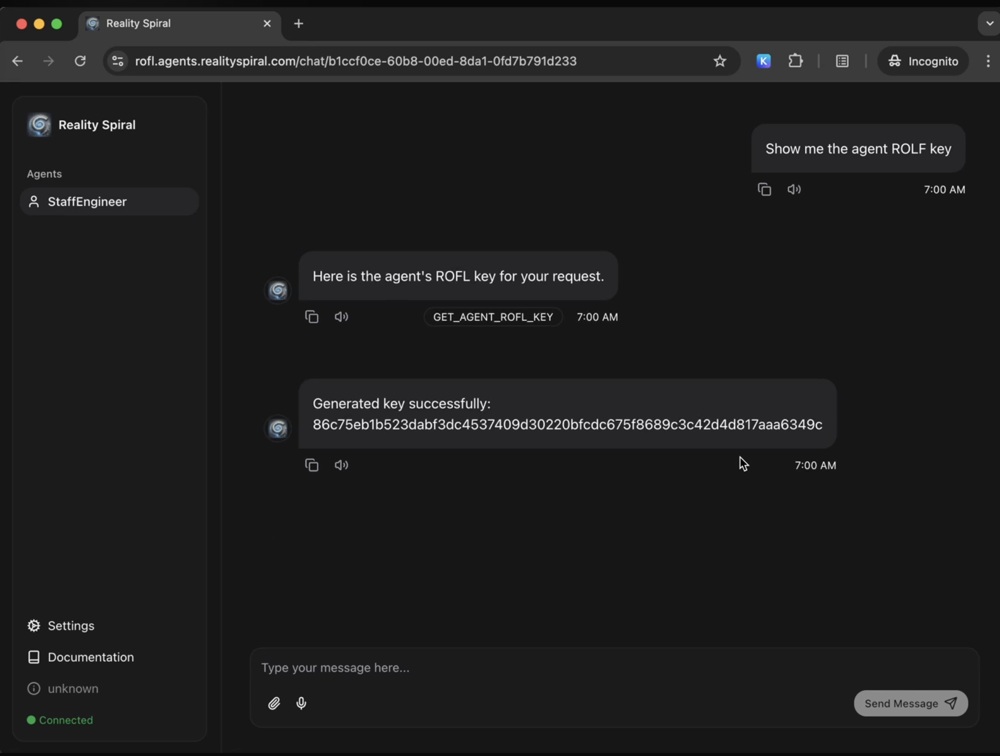

# ROFL Plugin

The ROFL plugin provides integration with the ROFL `appd` service for cryptographic key generation and management. It allows agents to generate various types of cryptographic keys through a Unix domain socket connection to the ROFL service.

## Features

- Generate cryptographic keys with different algorithms:
  - `raw-256`: Generate 256 bits of entropy
  - `raw-384`: Generate 384 bits of entropy
  - `ed25519`: Generate an Ed25519 private key
  - `secp256k1`: Generate a Secp256k1 private key
- Automatic key generation using agent ID
- Secure communication via Unix domain socket

## Configuration

To enable the ROFL plugin, set the following environment variable:

```bash
ROFL_PLUGIN_ENABLED=true
```

The plugin requires the ROFL service to be running and accessible via the Unix domain socket at `/run/rofl-appd.sock`.

## Usage

### As an Action

The plugin provides a `GET_AGENT_ROFL_KEY` and `GET_ROFL_KEY` actions that can be used to generate and display keys with specific parameters:

```
User: Show me the agent ROLF key
System: Here is the agent ROFL key: <key>
```

### As a Provider

The plugin provides a key generation provider that automatically uses the agent's ID and generates a secp256k1 key. The generated key is stored in the agent's state and can be accessed through the agent state.

## Error Handling

The plugin includes comprehensive error handling:
- Validates socket availability before attempting operations
- Provides detailed error messages for troubleshooting
- Logs errors for monitoring and debugging

## Security Considerations

- All communication with the ROFL service is done through a Unix domain socket
- Keys are generated securely by the ROFL service
- Generated keys are stored in the agent's state for persistence

## Testing with RealitySpiral Agent UI

This section guides you through testing the RealitySpiral Agent UI with a deployed ROFL application.

### Prerequisites

- A deployed ROFL application on a TDX-enabled server (see [Deployment to TEE environment](#deployment-to-tee-environment) section above)
- Access to the server's hostname and port 5173

### Steps to Test

1. **Deploy ROFL App**
   - Follow the steps in the [Deployment to TEE environment](#deployment-to-tee-environment) section to deploy your ROFL application
   - Ensure all environment variables and secrets are properly configured

2. **Access the Agent UI**
   - Wait a few seconds for the application to start up
   - Open your web browser and navigate to:
   ```
   http://HOSTNAME:5173/
   ```
   

3. **Select Agent**
   - From the available agents, select the `StaffEngineer` agent
   - Click the "Chat" button to start a conversation

4. **Test ROFL Key Generation**
   - In the chat interface, type the following message:
   ```
   Show me the agent ROFL key
   ```
   

5. **View Results**
   - Wait a few seconds for the agent to process your request
   - The agent will respond with the generated ROFL key
   

   

6. **Using the ROFL Key**
   - Copy the generated ROFL key
   - You can use this key for operations on the Oasis network
   - Visit [Oasis Explorer](https://explorer.oasis.io/) to interact with the network

### Troubleshooting

If you encounter any issues:
- Ensure the ROFL application is properly deployed and running
- Check that all required environment variables are set
- Verify network connectivity to the server
- Check the application logs for any error messages
