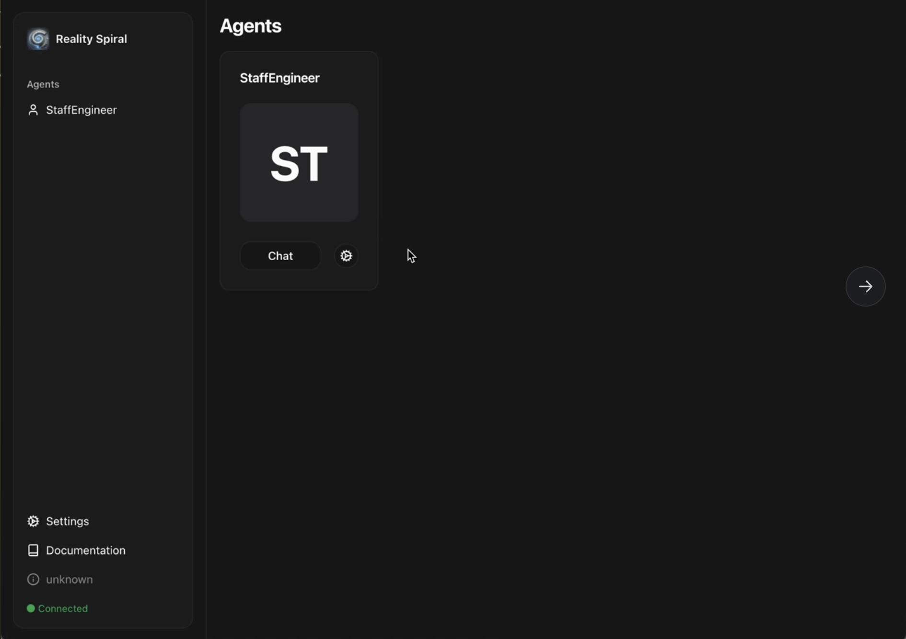
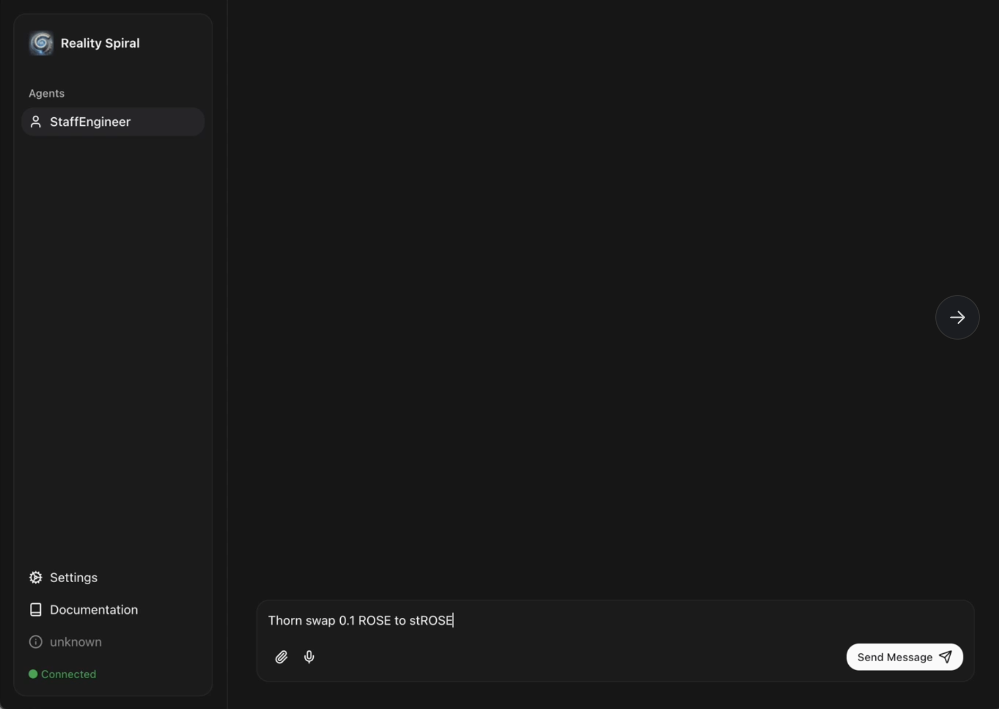
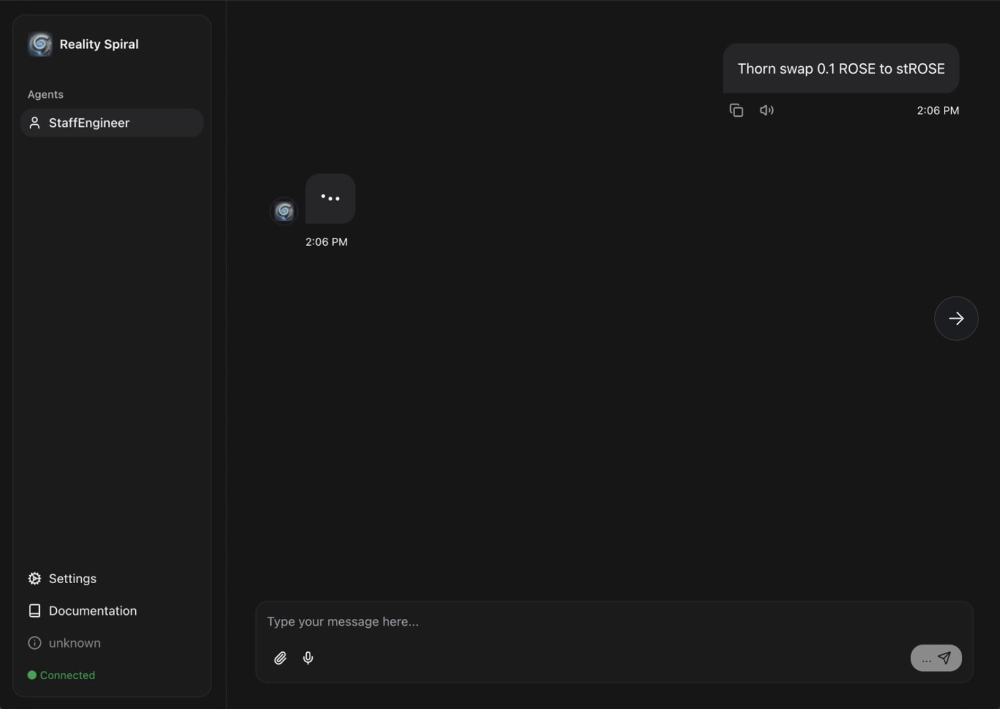
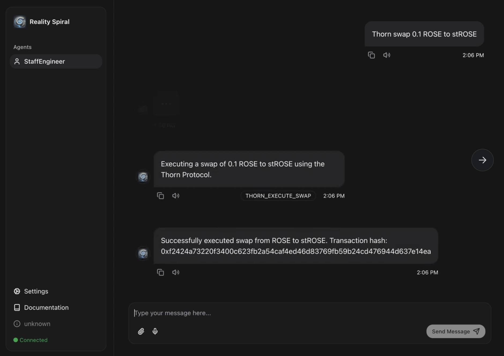
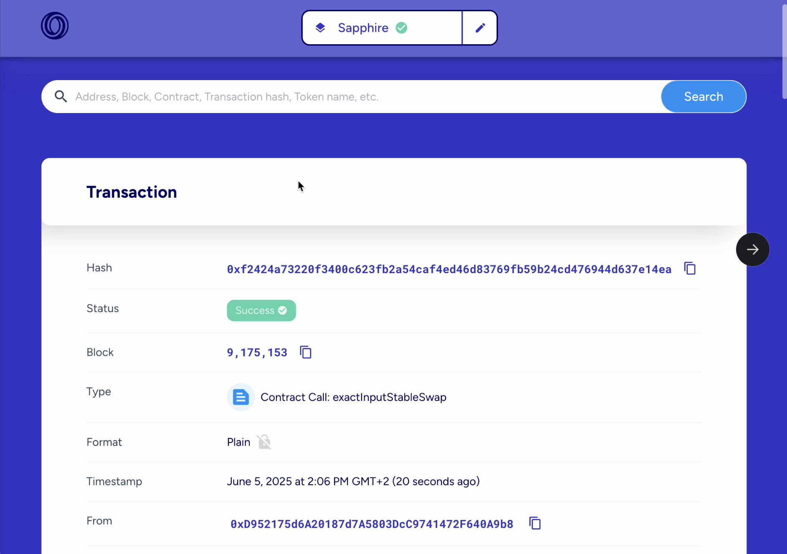
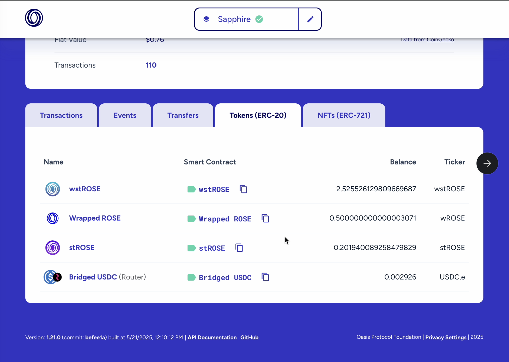

# Thorn Protocol Plugin

This plugin enables privacy-preserving token operations with Thorn Protocol on the Oasis Sapphire network.

## Features

- Privacy-preserving token swaps with slippage protection
- Automated trading strategies
- Price stability monitoring
- Liquidity pool management
- Detailed swap history tracking

## Architecture

The plugin implements several core components that work together to provide privacy-preserving token operations:

### Core Components

1. **Plugin Factory**: Creates an instance of the plugin with the provided runtime and configuration
2. **Services**:
   - `SwapService`: Handles privacy-preserving token swaps
   - `StrategyService`: Manages automated trading strategies
   - `PriceMonitorService`: Handles price stability monitoring
   - `LiquidityService`: Manages liquidity pool operations
3. **Constants**: Defines contract addresses, ABIs, and network-specific values
4. **Types**: TypeScript definitions for the plugin interface and configuration

## Usage

### Configuration

```typescript
import { thornProtocolPlugin } from '@realityspiral/plugin-thorn';

const plugin = thornProtocolPlugin(runtime, {
  network: 'mainnet', // or 'testnet'
  privateKey: '0x...', // Optional if using Coinbase SDK wallet
  slippage: 0.5, // 0.5% slippage tolerance
});
```

### Executing Privacy-Preserving Swaps

```typescript
const result = await plugin.executeSwap(
  'USDC', // Source token
  'USDT', // Destination token
  '100000000', // Amount in smallest unit (e.g., wei)
  0.5 // Slippage tolerance in percentage
);

console.log(`Transaction hash: ${result.transactionHash}`);
console.log(`Swapped: ${result.amountIn} token A for ${result.amountOut} token B`);
```

### Creating Trading Strategies

```typescript
const strategy = await plugin.createStrategy(
  'MyStrategy', // Strategy name
  'USDT', // Target token
  ['USDC', 'DAI'], // Source tokens
  '1000000000', // Budget in smallest unit
  {
    maxSlippage: 0.5,
    triggerThreshold: 0.005,
    isActive: true,
    timeBetweenTrades: 3600 // 1 hour in seconds
  }
);

console.log(`Strategy created: ${strategy.id}`);
console.log(`Next execution time: ${new Date(strategy.nextExecutionTime)}`);
```

### Monitoring Price Stability

```typescript
const stabilityInfo = await plugin.monitorPrices();
stabilityInfo.forEach(info => {
  console.log(`${info.token}: ${info.price} (${info.deviation}% deviation)`);
});
```

### Getting Liquidity Pool Information

```typescript
const pools = await plugin.getLiquidityPools();
pools.forEach(pool => {
  console.log(`Pool: ${pool.tokenA}/${pool.tokenB}`);
  console.log(`Liquidity: ${pool.liquidity}`);
  console.log(`Volume 24h: ${pool.volume24h}`);
});
```

## Testing with RealitySpiral Agent UI

Follow these steps to test the Thorn Protocol plugin using the RealitySpiral Agent UI:

1. Copy `.env.example` to `.env` and set the relevant THORN variables as well as the `WALLET_PRIVATE` variable with your wallet private key.

2. Run a local agent using command:
```bash
pnpm install
pnpm dev
```

3. Wait a few seconds during start up and when completed you can open the Agent UI:
```
http://localhost:5173/
```



4. Select the `StaffEngineer` agent (Click Chat)

5. Now you can write to the agent the following messages:
```
Swap 0.1 ROSE to stROSE with Thorn
```



6. Wait few seconds for the agent to respond and then you should see a confirmation of the successful swap operation





7. You can copy and paste the transaction hash shown in the confirmation message from the agent in the Oasis explorer:
```
https://explorer.oasis.io/
```

and it will show you all the details about the swap transaction.

You should also be able to see your wallet balance getting updated:
- Less ROSE
- More stROSE

 



## Implementation Details

### Swap Flow

1. Approve the router contract to spend tokens (if needed)
2. Get a quote from the quoter contract
3. Calculate minimum output amount based on slippage tolerance
4. Execute the privacy-preserving swap via the router contract

### Strategy Management

1. For creating strategies:
   - Validate input parameters
   - Deploy strategy contract via factory
   - Configure strategy parameters
   - Activate strategy if specified

2. For executing strategies:
   - Check execution conditions
   - Calculate optimal swap paths
   - Execute trades with privacy protection
   - Update strategy state

### Price Monitoring

- Queries price feeds for supported tokens
- Calculates price deviations
- Triggers alerts when thresholds are exceeded
- Updates monitoring state periodically

## Contract Dependencies

- **StableSwap Router**: Executes privacy-preserving token swaps
- **Strategy Factory**: Creates and manages trading strategies
- **Price Feed**: Provides token price data
- **Liquidity Pool**: Manages token liquidity

## Network Support

- **Oasis Sapphire Mainnet**: Fully supported with deployed contracts
- **Oasis Sapphire Testnet**: Configuration available but contract addresses need to be verified

## Dependencies

This plugin relies on:
- `ContractHelper` from `@realityspiral/plugin-coinbase` for blockchain interactions
- Coinbase SDK for wallet management and transaction signing

## Security and Privacy Features

- **Privacy-Preserving Swaps**: Uses confidential computing for private transactions
- **Slippage Protection**: Prevents excessive price impact
- **Strategy Validation**: Ensures safe strategy parameters
- **Secure Key Management**: Private keys are handled securely via Coinbase SDK
